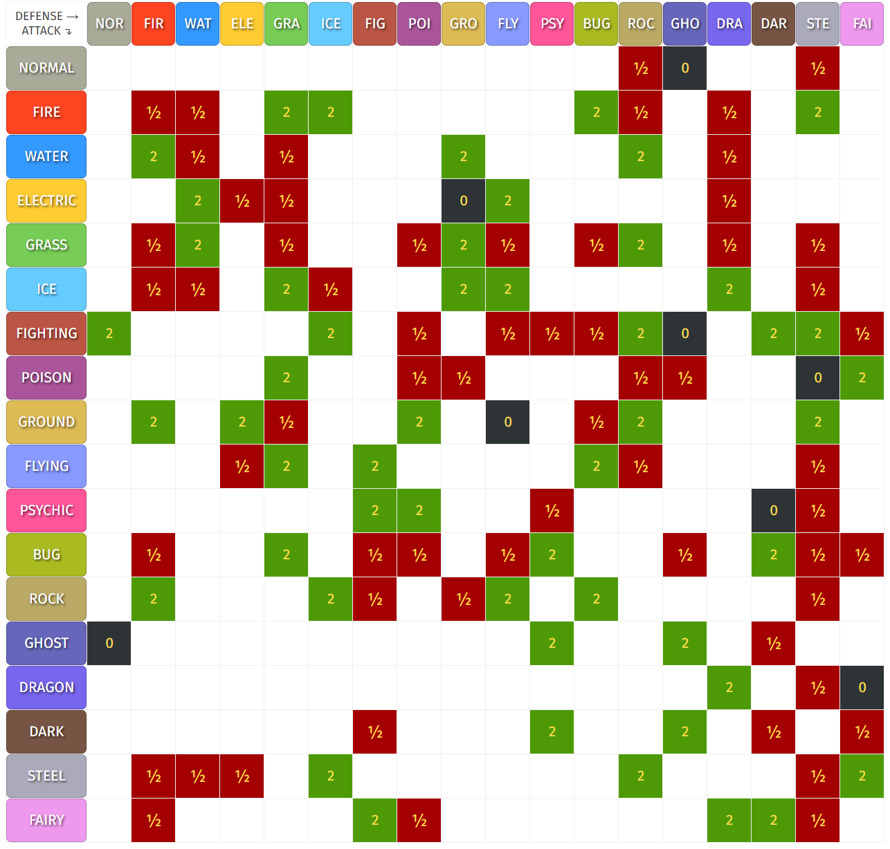

# Pokemon Battle

Imagine you're a pokemon trainer. You want to determine the affect of another pokemon's attack on your star pokemon.

Your pokemon has two **types**, and each type has its strengths and weaknesses against attacks.

For example, _fire_ is weak against _water_,meaning it gets **2x** damage from water ("super effective"). _Rock_ takes **1/2** damage from _fire_ ("not very effective").

Here's a chart of the effects:



You can open this chart here: [https://pokemondb.net/type](https://pokemondb.net/type)

## Using the chart

Find your pokemon's type along the **top** ("defense"), and read downwards to see the effect of an attack. If the space is blank, it's "normal", or **1x** effetive.

When a pokemon has **2** types, the effects multiply. For example, let's say you have a Bulbasaur with _grass_ and _poison_ types. It's being attacked with a _grass_ attack. The total effect would be:

```
Grass vs. Grass -> 0.5 effect
Grass vs. Poison -> 0.5 effect
0.5 * 0.5 = 0.25 -> The attack is 25% effective!
```

## Your task

Write a program that lets you input attack types, and it will tell you how effective the attack will be against your star pokemon. Allow the user to keep entering attacks until they type "quit".

To the right, you'll find some starting code has already been added for you.

## Step 1: Entering the data

First, your program needs to understand what the effects are for your chosen types. Pick any two types that your pokemon has.

Add a dictionary to hold the data from the chart - for each column under your two chosen types. To get you started, there's an example type ("normal") shown.

